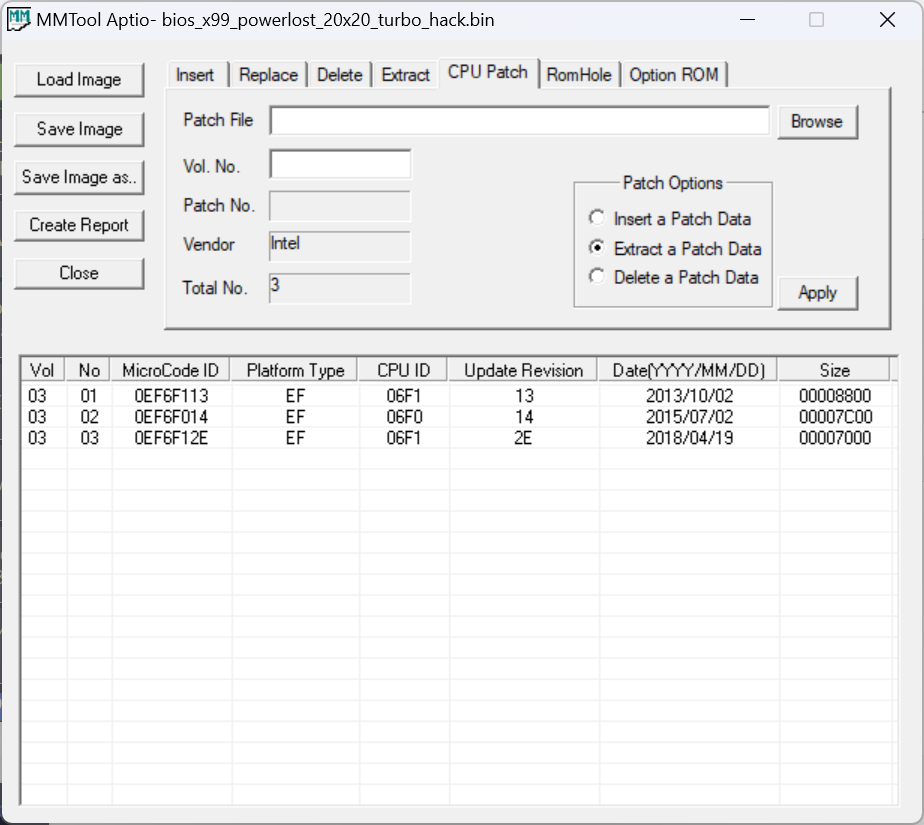
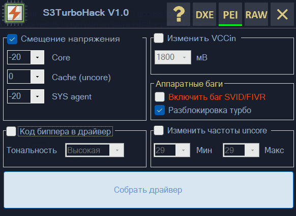
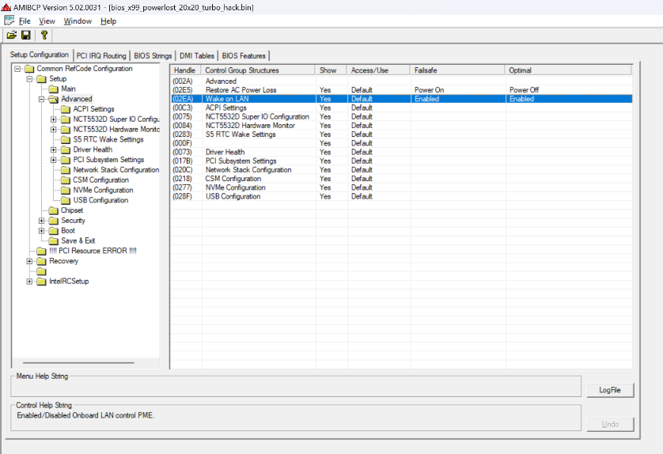
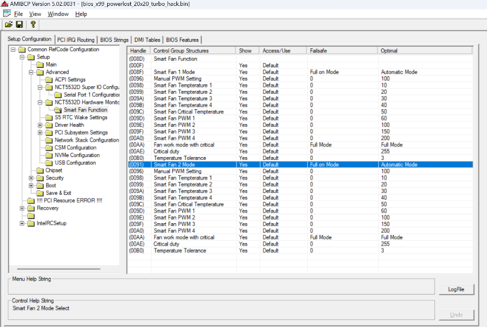
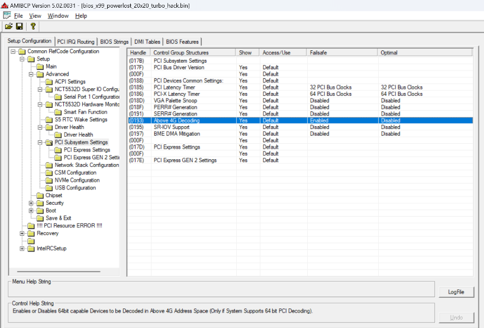
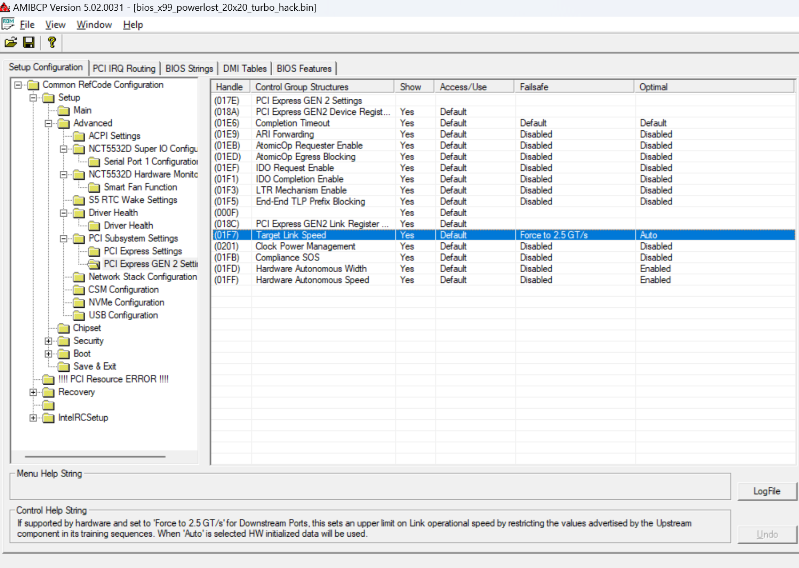
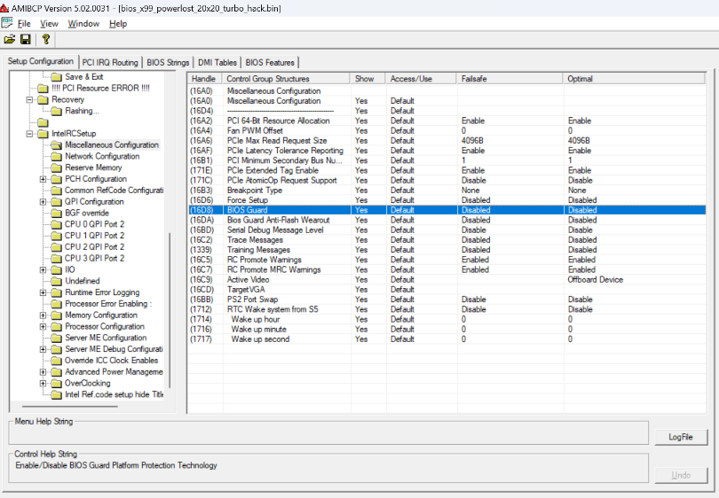
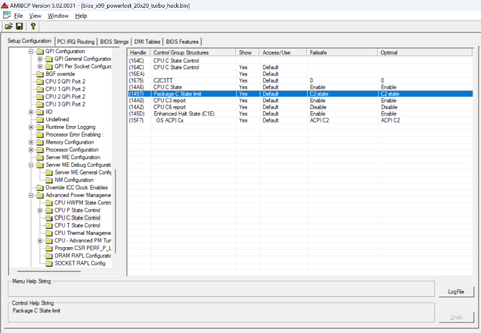
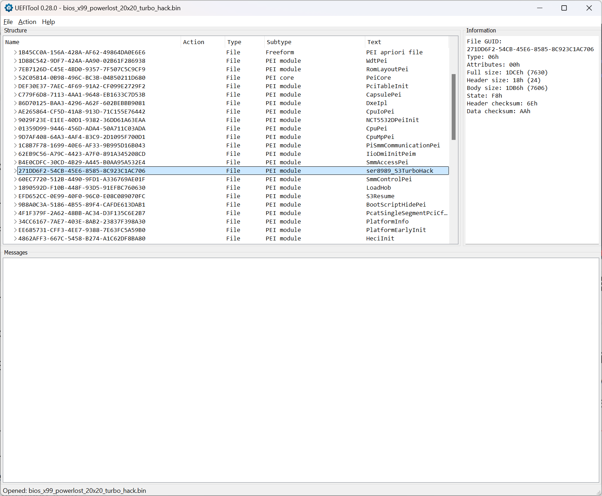

# Documento de Procedimentos: Modificações na BIOS da Placa-Mãe Atermiter X99 V1.41 para Mineração

Este guia detalha as alterações realizadas na BIOS utilizando ferramentas específicas, com foco em otimização para mineração e melhorias gerais no desempenho do sistema. A documentação aborda cada configuração alterada, explicando os impactos e a forma de aplicá-las.

---

## Ferramentas Utilizadas
- **S3TurboTool**: Ajustes de tensão, frequência e turbo boost.
- **AMIBCP**: Modificações avançadas de configurações da BIOS.
- **MMTool Aptio**: Remoção de patches de microcode e substituição de módulos.
- **UEFITool**: Substituição de módulos específicos na BIOS.

---

## Alterações Realizadas e Impactos

### 1. **Remoção do Patch de Microcode 06F2**
- **Motivo**: Compatibilidade com CPUs específicas e estabilidade em mineração.
- **Impacto**: Remove suporte a CPUs não utilizadas para liberar espaço e melhorar estabilidade.
- **Ferramenta**: **MMTool**.
  
  

---

### 2. **Manutenção da Tensão no Cache (Uncore)**
- **Configuração**: Cache Voltage Offset mantido em `0mV`.
- **Motivo**: Evitar instabilidades que ocorrem ao reduzir a tensão do cache em cargas pesadas.
- **Impacto**: Garantia de estabilidade em ambientes de alto uso, como mineração.
- **Ferramenta**: **S3TurboTool**.

  

---

### 3. **Habilitar Wake On LAN**
- **Configuração**: Alterado para `Enabled` no AMIBCP.
- **Motivo**: Permitir o ligamento remoto da máquina via rede.
- **Impacto**: Facilita a reinicialização e o gerenciamento remoto do sistema.
  
  

---

### 4. **Configuração de Ventiladores para Full Mode**
- **Configuração**: Alterado para `Full Mode` em todas as entradas de controle de ventiladores.
- **Motivo**: Garantir refrigeração máxima, reduzindo risco de superaquecimento durante mineração.
- **Impacto**: Aumenta o resfriamento ao custo de ruído mais elevado.
  
  

---

### 5. **Habilitar Above 4G Decoding**
- **Configuração**: Alterado para `Enabled` no AMIBCP.
- **Motivo**: Suporte a GPUs e dispositivos PCIe com endereçamento acima de 4 GB.
- **Impacto**: Necessário para rigs de mineração que utilizam múltiplas GPUs.
  
  

---

### 6. **Forçar PCI Express Target Link em 2.5 GT/s**
- **Configuração**: Ajustado para `2.5 GT/s`.
- **Motivo**: Estabilizar a comunicação com dispositivos PCIe.
- **Impacto**: Reduz problemas de incompatibilidade e falhas de link em rigs de mineração.
  
  

---

### 7. **Desabilitar Hardware Speed e Width no PCI Express**
- **Configuração**: Alterado para `Disabled`.
- **Motivo**: Evitar ajustes automáticos que podem causar instabilidade.
- **Impacto**: Garante estabilidade no barramento PCIe.
  
  

---

### 8. **Desabilitar BIOS Guard**
- **Configuração**: Alterado para `Disabled`.
- **Motivo**: Permitir gravações frequentes e customização da BIOS sem restrições de segurança.
- **Impacto**: Facilita modificações, mas aumenta riscos de segurança.
  
  

---

### 9. **Gerenciamento de Energia (C-State Configurações)**
- **C-State**:
  - **C1E**: Habilitado.
  - **C2**: Ajustado para `Enabled`.
  - **C3**: Ajustado para `Enabled`.
  - **C6**: Ajustado para `Disabled`.
- **Motivo**: Melhorar estabilidade e consumo energético para cargas constantes.
- **Impacto**: Reduz consumo desnecessário e otimiza para cargas estáveis.
  
  

---

### 10. **Substituição do Módulo 271C62F2**
- **Configuração**: Substituído pelo módulo personalizado **Turbo Hack**.
- **Motivo**: Ativar melhorias de energia específicas e configurações avançadas de turbo boost.
- **Impacto**: Garantia de melhor desempenho sob cargas constantes.
- **Ferramenta**: **UEFITool**.

  

---

## Passo a Passo para Aplicar as Alterações

1. **Backup da BIOS Atual**:
   ```bash
   sudo flashrom -p internal -r backup_bios.bin
   ```

2. **Remoção do Patch 06F2 com MMTool**:
   - Abra a BIOS no **MMTool**.
   - Navegue até a aba **CPU Patch** e remova o patch `06F2`.

3. **Substituir o Módulo 271C62F2 no UEFITool**:
   - Carregue a BIOS no **UEFITool**.
   - Localize o módulo `271C62F2` e substitua pelo módulo personalizado **Turbo Hack**.
   - Salve a BIOS modificada.

4. **Alterações no AMIBCP**:
   - Faça todas as alterações conforme listadas na seção de impacto.

5. **Aplicar as Configurações no S3TurboTool**:
   - Configure as tensões:
     - **Core Voltage Offset**: `-20mV`.
     - **Agent Voltage Offset**: `-20mV`.
     - **Cache Voltage Offset**: `0mV`.
   - Habilite o **Turbo Unlock (20x20)**.

6. **Gravar a BIOS Modificada**:
   ```bash
   sudo flashrom -p internal -w bios_modificada.bin
   ```

---
